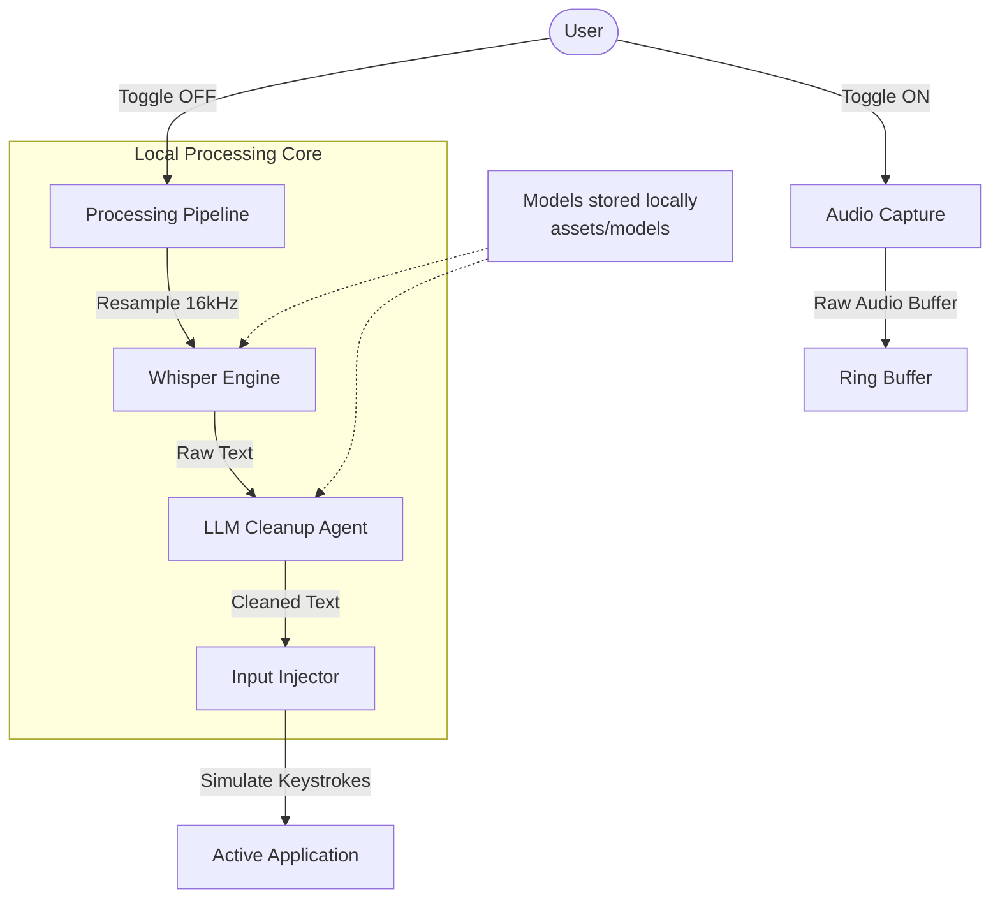

<!--
  LocalVoiceSync
  Privacy-First, Local Speech-to-Text with Intelligent Cleanup
-->

<div align="center">

# LocalVoiceSync
### Privacy-First Speech-to-Text for Linux

[](https://flutter.dev/)

**Speak naturally. We'll handle the rest.**

[Features](#key-features) •
[Installation](#installation) •
[Architecture](#architecture) •
[Contributing](#contributing)

</div>

---


## 🚀 Overview

**LocalVoiceSync** is a privacy-first, toggle-to-record speech-to-text application designed for Linux desktops. Unlike cloud-based assistants or standard dictation tools, LocalVoiceSync processes everything locally on your device and uses an intelligent LLM (Large Language Model) pipeline to clean up your speech instantly.

Say goodbye to "ums", "ahs", stuttering, and grammatical errors. Just press a global hotkey, speak your thoughts freely, and watch polished, professional text appear in your active window.

### Why LocalVoiceSync?

- **🔒 100% Privacy**: Your voice never leaves your machine. No cloud APIs, no data mining.
- **🧠 Intelligent Cleanup**: Removes filler words, fixes stuttering, and corrects grammar automatically.
- **⚡ Zero Latency Feel**: Optimized for local GPU acceleration.
- **🐧 Linux First**: Native integration with Wayland and X11.

---

## ✨ Key Features

- **Multiple Recording Modes**:
  - **Manual Toggle**: Press once to start, press again to stop (Global Hotkey).
  - **Live Mode (VAD)**: Voice Activation Detection automatically starts/stops recording based on speech.
- **Global Hotkey**: Trigger dictation from *any* application (default: `Ctrl+Alt+V`).
- **Smart Injection**: Automatically types or pastes cleaned text into your foreground app (VS Code, Obsidian, Browser, etc.).
- **Dual Engine**:
  - **Whisper**: Industry-leading speech recognition accuracy.
  - **Ollama**: Context-aware text refinement and grammar correction using local LLMs.
- **History Management**: Keep track of your raw vs. cleaned transcriptions.
- **Native Linux Performance**: Built with **Flutter** for a modern UI and C++ for high-performance audio processing.

---

## 🛠️ Architecture

LocalVoiceSync uses a sophisticated local pipeline to transform audio into polished text.



---

## 📦 Installation & Building

LocalVoiceSync is a **Flutter application** with native C++ components for Whisper and VAD.

### 🛠️ Dependencies (Fedora/RHEL)
```bash
# Flutter Requirements
sudo dnf install clang cmake ninja-build pkg-config gtk3-devel

# Hardware Acceleration
sudo dnf install vulkan-loader-devel mesa-vulkan-devel
```

### 🔨 Build Process
```bash
# Install dependencies
flutter pub get

# Build native components
# (Managed automatically by Flutter during build)

# Run
flutter run -d linux
```

---

## 🧠 Development Practices

- **Framework**: Flutter (Dart).
- **Native Interop**: Dart FFI for high-performance C++ bindings.
- **Hardware Acceleration**: GPU acceleration enabled for Whisper inference.
- **State Management**: Riverpod for a clean and reactive architecture.

---

## ⚙️ Configuration & Models

LocalVoiceSync relies on local AI models and customizable settings.

### 1. Recording & Hotkeys
- **Global Hotkey**: `Ctrl+Alt+V` toggles recording.
- **VAD Sensitivity**: Adjust how easily speech triggers recording in Live mode.

### 2. Whisper Model (Speech-to-Text)
We recommend `large-v3-turbo` for the best balance of speed and accuracy.
- **Location**: `assets/models/`
- **Supported Formats**: `.bin` (ggml)

### 3. LLM Model (Text Cleanup)
Powered by **Ollama**.
- **Recommended**: `llama3.2:1b` or `qwen2.5:1.5b`.
- **Setup**:
  ```bash
  # Install Ollama
  curl -fsSL https://ollama.com/install.sh | sh
  
  # Pull the cleanup model
  ollama pull llama3.2:1b
  ```

---

## 🖥️ Usage Guide

1. **Launch the App**: Start LocalVoiceSync.
2. **Setup**: Go to Settings, ensure Ollama is running and models are detected.
3. **Select Mode**: Choose between **Manual** or **Live (VAD)**.
4. **Record**:
   - Focus any text field in any app.
   - Press `Ctrl+Alt+V` or just start speaking.
5. **Watch**: The app will process your audio and type the corrected text into your window.

---

## 🤝 Contributing

We welcome contributions!

1. Fork the Project
2. Create your Feature Branch (`git checkout -b feature/AmazingFeature`)
3. Commit your Changes (`git commit -m 'Add some AmazingFeature'`)
4. Push to the Branch (`git push origin feature/AmazingFeature`)
5. Open a Pull Request

---

## 📄 License

Distributed under the MIT License. See `LICENSE` for more information.

---

<div align="center">
  <p>Made with ❤️ for the Linux Community</p>
</div>
