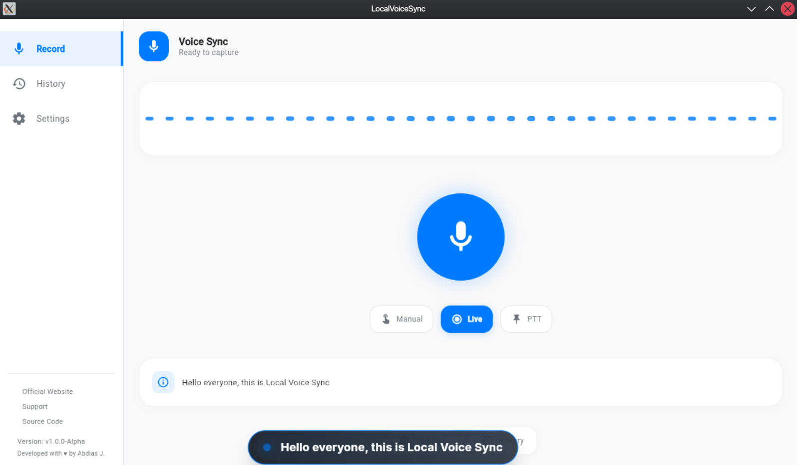
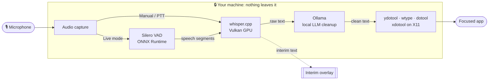

<!--
  LocalVoiceSync
  Privacy-First, Local Speech-to-Text with Intelligent Cleanup
-->

<div align="center">

# 🎙️ LocalVoiceSync

### Privacy-first speech-to-text for Linux

**Speak naturally. We'll handle the rest.**

[](#-installation)
[](#-installation)
[](https://flutter.dev/)
[](https://github.com/ggml-org/whisper.cpp)
[](https://ollama.com/)
[](LICENSE)

[Demo](#-see-it-in-action) •
[Features](#-features) •
[Installation](#-installation) •
[Usage](#%EF%B8%8F-usage) •
[Architecture](#%EF%B8%8F-architecture) •
[Contributing](#-contributing)

<br>

<a href="https://cdn.jsdelivr.net/gh/AxDSan/localvoicesync@master/images/demo.mp4">
  
</a>

<sub>🔊 <a href="https://cdn.jsdelivr.net/gh/AxDSan/localvoicesync@master/images/demo.mp4"><b>Watch the full film with sound</b></a> · 42 s · 1080p</sub>

</div>

---

## 🚀 Overview

**LocalVoiceSync** turns your voice into clean, ready-to-send text in whatever app has focus, and it does all of it on your own machine.

You talk the way people actually talk: *"um"*, *"like"*, false starts and all. [Whisper](https://github.com/ggml-org/whisper.cpp) transcribes it on your GPU, a local LLM running in [Ollama](https://ollama.com/) strips the filler and fixes the grammar, and the result is typed straight into your chat, terminal, editor or email.

### 🎬 See it in action

The film above is one working day, three dictations. The transcripts below are the pipeline's real output for those takes:

| 🗣️ You say (raw Whisper) | ✨ You get (after local LLM cleanup) | 📍 Typed into |
| --- | --- | --- |
| ~~Um,~~ so I was thinking, ~~like,~~ we should, ~~uh,~~ probably ship ~~the,~~ the update on Friday? Yeah. | So I was thinking we should probably ship the update on Friday? Yes. | Team chat |
| Fix the login bug when the token expires. | Fix the login bug when the token expires. | `git commit -m` |
| Hey, Sarah. Just wanted to say thanks for, ~~like,~~ covering for me yesterday. You're the best. | Hey, Sarah. Just wanted to say thanks for covering for me yesterday. You're the best. | Email |

Already-clean speech passes through untouched; only the filler goes.

### 💡 Why LocalVoiceSync?

- **🔒 Nothing leaves your machine.** No cloud APIs, no accounts, no telemetry. Audio, transcripts and cleanup all stay local.
- **🧠 Intelligent cleanup.** Filler words, stutters and repeated words are removed and grammar is fixed, while your meaning stays yours.
- **⚡ Fast.** whisper.cpp runs on your GPU through Vulkan, and the Ollama model is preloaded so cleanup doesn't stall after you stop talking.
- **🐧 Linux first.** Works on Wayland and X11, and types into any focused app.

---

## ✨ Features

- **🎛️ Three recording modes**
  - **Manual**: click the record button to start, click again to stop.
  - **Live**: [Silero VAD](https://github.com/snakers4/silero-vad) listens continuously and records whenever you speak.
  - **Push-to-talk (PTT)**: hold a key while you talk, release to send. Defaults to `F12` and can be rebound in Settings. Pressing it in any mode switches the app to PTT automatically.
- **💬 Live interim overlay**: a floating pill shows what Whisper is hearing while you speak.
- **⌨️ Types into any app**: `ydotool` (with `wtype` and `dotool` as fallbacks) on Wayland, `xdotool` on X11, or clipboard + paste if you prefer.
- **🗂️ History**: every dictation keeps its raw and cleaned version side by side.
- **🩺 Built-in health check**: `./doctor.sh` checks models, microphone, Ollama, injection tools and free VRAM before the app starts, and prints a fix for anything that's off.
- **🏎️ Native where it counts**: whisper.cpp, an ONNX Runtime VAD and X11 key polling in C/C++, wired into a Flutter UI through Dart FFI.

<div align="center">
  
</div>

---

## 📦 Installation

LocalVoiceSync is a **Flutter** desktop app with native C/C++ components for Whisper, VAD and hotkeys.

### 1. System dependencies (Fedora/RHEL)

```bash
# Flutter Linux toolchain
sudo dnf install clang cmake ninja-build pkg-config gtk3-devel

# GPU acceleration for Whisper
sudo dnf install vulkan-loader-devel mesa-vulkan-devel

# Text injection
sudo dnf install ydotool xinput wtype   # Wayland (default on Fedora)
sudo dnf install xdotool                # X11
```

> [!NOTE]
> `ydotool` needs its `ydotoold` daemon. `./run.sh` starts it for you as your own user (no `sudo`); it only needs write access to `/dev/uinput`, which the active desktop session normally gets through a udev `uaccess` rule.

### 2. Models

Put the Whisper and VAD models in `assets/models/`. They're bundled with the build and copied to `~/.local/share/localvoicesync/models/` on first run.

```bash
curl -L -o assets/models/ggml-large-v3-turbo.bin \
  https://huggingface.co/ggerganov/whisper.cpp/resolve/main/ggml-large-v3-turbo.bin
curl -L -o assets/models/silero_vad.onnx \
  https://github.com/snakers4/silero-vad/raw/master/src/silero_vad/data/silero_vad.onnx
```

Then install [Ollama](https://ollama.com/) and pull the cleanup model:

```bash
curl -fsSL https://ollama.com/install.sh | sh
ollama pull llama3.2:1b
```

### 3. Build & run

```bash
flutter pub get
./run.sh          # build and run (recommended)
./run.sh --fast   # run the last debug build without rebuilding
```

### 🩺 Health check

`./run.sh` runs `./doctor.sh` first. It checks the build toolchain, the Whisper and VAD models, the microphone, Ollama and the configured cleanup model, the text-injection tools (starting `ydotoold` if needed), and free VRAM. If anything fails, the app doesn't start and each failure prints its fix. Run it on its own any time:

```bash
./doctor.sh                    # full check
./doctor.sh --no-build-checks  # skip toolchain checks (what ./run.sh --fast uses)
```

> [!TIP]
> **Wayland users:** Wayland doesn't let apps position their own windows. Always start through `./run.sh`; it sets `GDK_BACKEND=x11` so the interim overlay can place itself at the bottom of your screen.

---

## 🖥️ Usage

1. **Launch** with `./run.sh`.
2. **Check Settings**: make sure Ollama is reachable and your models are detected.
3. **Pick a mode**: Manual, Live or PTT.
4. **Focus any text field** in any app and talk:
   - **Manual**: click the record button, speak, click again.
   - **Live**: just start speaking.
   - **PTT**: hold your push-to-talk key (default `F12`), speak, let go.
5. **Watch** the cleaned text appear where your cursor is.

---

## ⚙️ Configuration

Everything below lives in **Settings**.

| Setting | Default | Notes |
| --- | --- | --- |
| Whisper model | `ggml-large-v3-turbo.bin` | Any ggml `.bin` in `~/.local/share/localvoicesync/models/`. |
| Ollama endpoint | `http://localhost:11434` | |
| Cleanup model | `llama3.2:1b` | Small and fast; `qwen2.5:1.5b` is a good alternative. The demo film used `qwen2.5:7b-instruct`. |
| Push-to-talk key | `F12` | Click the card and press the key you want. |
| VAD threshold | `0.5` | How readily speech triggers recording in Live mode. |
| Injection method | Direct input | Switch to Clipboard to paste instead of type. |

---

## 🛠️ Architecture


```mermaid
flowchart LR
    Mic([🎙️ Microphone]) --> Capture[Audio capture]

    subgraph Machine["🔒 Your machine: nothing leaves it"]
        Capture -->|Live mode| VAD[Silero VAD<br/>ONNX Runtime]
        Capture -->|Manual / PTT| Whisper
        VAD -->|speech segments| Whisper[whisper.cpp<br/>Vulkan GPU]
        Whisper -->|raw text| LLM[Ollama<br/>local LLM cleanup]
        LLM -->|clean text| Inject[ydotool · wtype · dotool<br/>xdotool on X11]
    end

    Whisper -. interim text .-> Overlay[[Interim overlay]]
    Inject --> App([Focused app])
```

- **UI**: Flutter (Dart) with Riverpod for state.
- **Native interop**: Dart FFI bindings to whisper.cpp, the VAD wrapper and the X11 hotkey helper, built with CMake.
- **Cleanup**: Ollama over its local HTTP API, with the model kept warm between dictations.

---

## 🤝 Contributing

Contributions are welcome!

1. Fork the project
2. Create a feature branch (`git checkout -b feature/amazing-feature`)
3. Commit your changes (`git commit -m 'Add amazing feature'`)
4. Push the branch (`git push origin feature/amazing-feature`)
5. Open a pull request

---

## 📄 License

Distributed under the MIT License. See [`LICENSE`](LICENSE) for details.

---

<div align="center">
  <sub>Made with ❤️ for the Linux community</sub>
</div>
